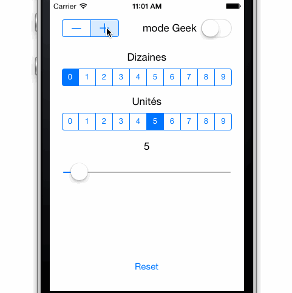

Exercice «DizainierGeek»
========================

Semaine: 3

Cours: [Programmation sur iPhone et iPad]

[Programmation sur iPhone et iPad]:
https://www.france-universite-numerique-mooc.fr/courses/UPMC/18001/Trimestre_2_2014/about

Établissement: [Université Pierre & Marie Curie](http://www.upmc.fr/)

Plateforme de MOOC: [FUN](https://www.france-universite-numerique-mooc.fr/)

